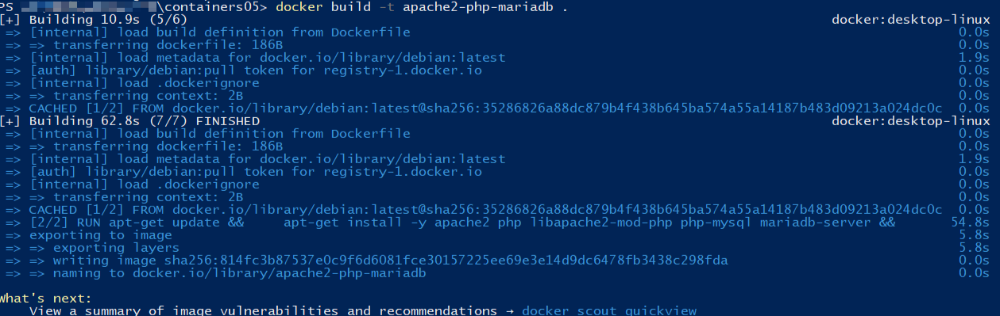
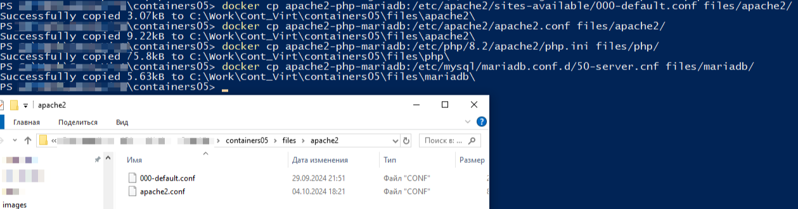
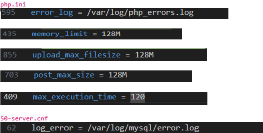
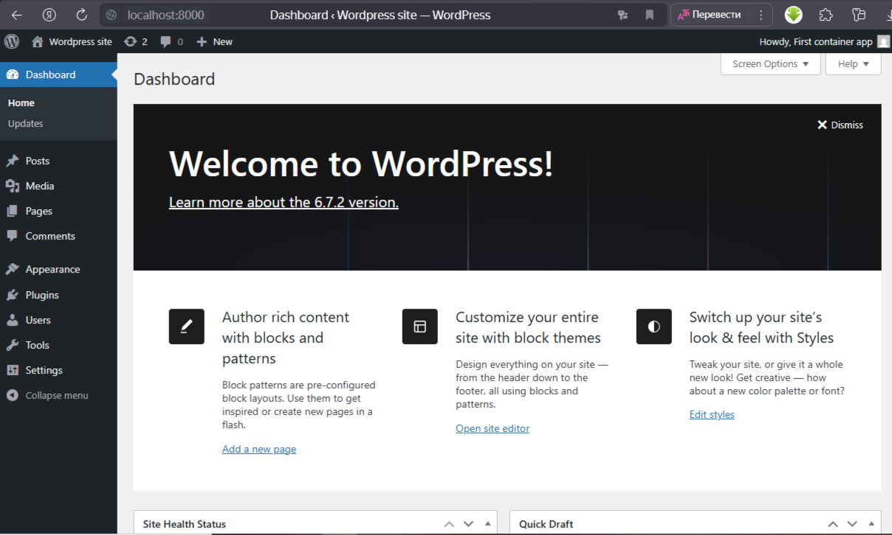
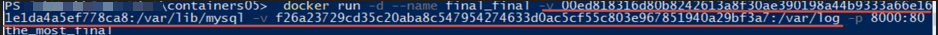
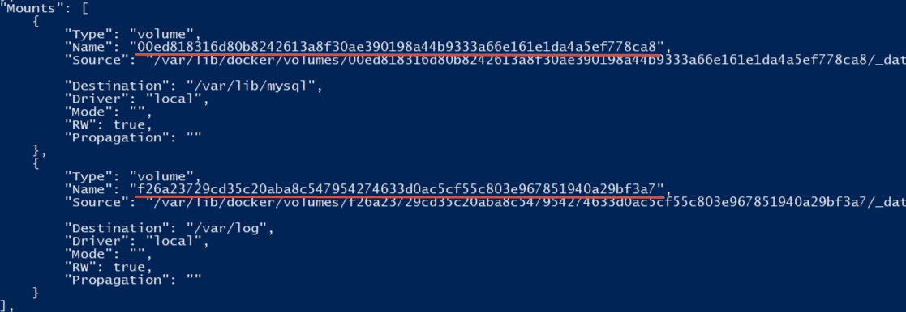

# Лабораторная работа №5: Запуск сайта в контейнере

## Цель работы

Выполнив данную работу, студент сможет подготовить образ контейнера для запуска веб-сайта на базе Apache HTTP Server + PHP (mod_php) + MariaDB.

## Задание

Создать Dockerfile для сборки образа контейнера, который будет содержать веб-сайт на базе Apache HTTP Server + PHP (mod_php) + MariaDB. База данных MariaDB должна храниться в монтируемом томе. Сервер должен быть доступен по порту 8000.

Установить сайт WordPress. Проверить работоспособность сайта.

## Описание выполнения работы

### Подготовка и извлечение конфигурационных файлов

1. Создал репозиторий на *GitHub* с именем `containers05` и склонировал его себе на ПК.

2. В папке `containers05` создал папку `files`, внутри которой создал директории:
   - `apache2` — для файлов конфигурации Apache2.
   - `php` — для файлов конфигурации PHP.
   - `mariadb` — для файлов конфигурации MariaDB.

3. В папке `containers05` создал **Dockerfile** с содержимым:

    ```dockerfile
    # create from debian image
    FROM debian:latest

    # install apache2, php, mod_php for apache2, php-mysql and mariadb
    RUN apt-get update && \
        apt-get install -y apache2 php libapache2-mod-php php-mysql mariadb-server && \
        apt-get clean
    ```

4. Создал образ и на его основе контейнер, который запустил в фоновом режиме с командой запуска bash.


5. Из контейнера извлек файлы конфигурации для *Apache2, PHP и MariaDB* с помощью следующих команд:

    ```bash
    docker cp apache2-php-mariadb:/etc/apache2/sites-available/000-default.conf files/apache2/
    docker cp apache2-php-mariadb:/etc/apache2/apache2.conf files/apache2/
    docker cp apache2-php-mariadb:/etc/php/8.2/apache2/php.ini files/php/
    docker cp apache2-php-mariadb:/etc/mysql/mariadb.conf.d/50-server.cnf files/mariadb/
    ```

    

6. Внес изменения в конфигурационные файлы:
    - В конфигурационных файлах *Apache2* установил имя сервера как *localhost*, связал его с почтой и указал корневую директорию для поиска файлов (*DocumentRoot*) по пути: `/var/www/html`. Также добавил строку `DirectoryIndex`, чтобы файл `index.php` был в приоритете для обработки.

    - В конфигурационном файле `php.ini` указал директорию для логирования: `log_error = /var/log/mysql/error.log = /var/log/php_errors.log`, а также установил следующие параметры:
    - `memory_limit = 128M`
    - `upload_max_filesize = 128M`
    - `post_max_size = 128M`
    - `max_execution_time = 120`

    - В файле `50-server.conf` указал директорию для логирования: `log_error = /var/log/mysql/error.log`

    

7. Создание скрипта запуска и **Dockerfile**

    - В папке `files` создал файл `supervisord.conf` для настройки корректного запуска контейнера и его компонентов с содержимым:

        ```ini
        [supervisord]
        nodaemon=true
        logfile=/dev/null
        user=root

        # apache2
        [program:apache2]
        command=/usr/sbin/apache2ctl -D FOREGROUND
        autostart=true
        autorestart=true
        startretries=3
        stderr_logfile=/proc/self/fd/2
        user=root

        # mariadb
        [program:mariadb]
        command=/usr/sbin/mariadbd --user=mysql
        autostart=true
        autorestart=true
        startretries=3
        stderr_logfile=/proc/self/fd/2
        user=mysql
        ```

    - В докерфайле добавил необходимые строки для создания томов под базу данных и логи,  инструкции для установки и распаковки файлов wordpress, и также команды дял копирования необходимых конфигурационных файлов из папок *files/apache2, files/php, files/mariadb* в создававемый контейнер, для  корректной работы сервера.

    - Также в докерфайле дописал команду для создания папки под базу данных, открыл права на ней и октрыл 80 порт для прослушивания (стандартный для веб-приложений)

    - в команде CMD добавил команду запуска **supervisord**

    Итоговый **Dockerfile**:

    ```bash
    FROM debian:latest

    # mount volume for mysql data
    VOLUME /var/lib/mysql

    # mount volume for logs
    VOLUME /var/log

    RUN apt-get update && \
        apt-get install -y apache2 php wget tar libapache2-mod-php php-mysql mariadb-server supervisor && \
        apt-get clean

    # installing and unpackaging wordpress
    RUN wget https://wordpress.org/latest.tar.gz -P /var/www/html/ && \
        tar -xzvf /var/www/html/latest.tar.gz -C /var/www/html/ && \
        cp -r /var/www/html/wordpress/* /var/www/html/ && \
        rm -rf /var/www/html/wordpress && \
        rm /var/www/html/latest.tar.gz


    COPY files/apache2/000-default.conf /etc/apache2/sites-available/000-default.conf

    COPY files/apache2/apache2.conf /etc/apache2/apache2.conf

    # copy the configuration file for php from files/ directory
    COPY files/php/php.ini /etc/php/8.2/apache2/php.ini

    # copy the configuration file for mysql from files/ directory
    COPY files/mariadb/50-server.cnf /etc/mysql/mariadb.conf.d/50-server.cnf

    # copy the supervisor configuration file
    COPY files/supervisor/supervisord.conf /etc/supervisor/supervisord.conf


    # create mysql socket directory
    RUN mkdir /var/run/mysqld && chown mysql:mysql /var/run/mysqld

    EXPOSE 80

    CMD ["/usr/bin/supervisord", "-n", "-c", "/etc/supervisor/supervisord.conf"]
    ```

8. Создал для пользователя базу данных в контейнере, куда будут сохраняться данные *wordpress*

    ```mysql
    CREATE DATABASE wordpress;
    CREATE USER 'wordpress'@'localhost' IDENTIFIED BY 'wordpress';
    GRANT ALL PRIVILEGES ON wordpress.* TO 'wordpress'@'localhost';
    FLUSH PRIVILEGES;
    EXIT; 
    ```

9. После создания и запуска контейнера, по адресу *localhost:8000* стала доступна стартовая страница wordpress, на которой указал параметры для подключения к базе данных

    - имя базы данных: `wordpress`;
    - имя пользователя: `wordpress`;
    - пароль: `wordpress`;
    - адрес сервера базы данных: `localhost`;
    - префикс таблиц: `wp_`.

    После того как был сконфигурирован файл `wp-config.php`, скачал его в папку `containers05/files`, и в докерфайле дописал инструкцию для его копирования в  соответствующую директорию, из которой происходит чтение файлов wordpress-ом:
    `COPY files/wp-config.php /var/www/html/wp-config.php`

    Данный файл содержит в себе необходимые параметры для подключения сервера к базе данных

10. После пересборки образа и запуска на его основе контейнера, по адресу `localhost:8000` открывается страница **wordpress**, которую можно далее настраивать по необходимости.

    

11. Недостатки текущего образа:

    - Автоматическое создание томом: при таком создании тома получают случайные неудобные для восприятия названия, которые при необходимости использования нужно будет ручками извлекать. Это будет продемонстрировано чуть дальше.
    - Отсутствие явного пользователя : использовать везде пользователя root, не лучшая идея, и например для бд, лучше было бы создать отдельного пользователя.
    - Монолитность системы: базу данных было бы лучше вынести в отдельный контейнер.

## Выводы

В ходе работы был запущен сайт на **wordpress**, с предшествующей настройкой всех необходимых компонентов, начиная от установки необходимых модулей, заканчивая экспортом/импортом и настройкой конфигурационных файлов и базы данных. Как итоговый результат, сайт был успешно запущен, что продемонстрировано на скриншоте ниже, были приобретены навыки работы с **wordpress**, создания и настройки базы данных и конфигурационных файлов, необходимых для корректной работы сервера.

## Библиография

`https://moodle.usm.md/mod/assign/view.php?id=282882`
`https://www.baeldung.com/ops/docker-volumes`
`https://chatgpt.com/`

## Additonal Part

Для более тщательного изучения работы томов в **Docker**, я создал еще один контейнер,который должен был подключиться к базе данных, используемой первым контейнером, для хранения данных wordpress. Таким образом, сайт можно будет запустить с любого из них, и все изменения будут также сохранены, так как они будут сохранаться не в локальной памяти контейнера, а в томах.


Однако так как при создании первого контейнера тома создавались автоматически, с произвольными названиями, то взаимодействие с ними происходит не самым удобным образом, а именно приходится самому извлекать их названия, при создании нового контейнера.


После запуска нового контейнера подключеннего к томам контейнера apache2-php-mariadb, он также успешно запустил **wordpess** на *localhost*.
